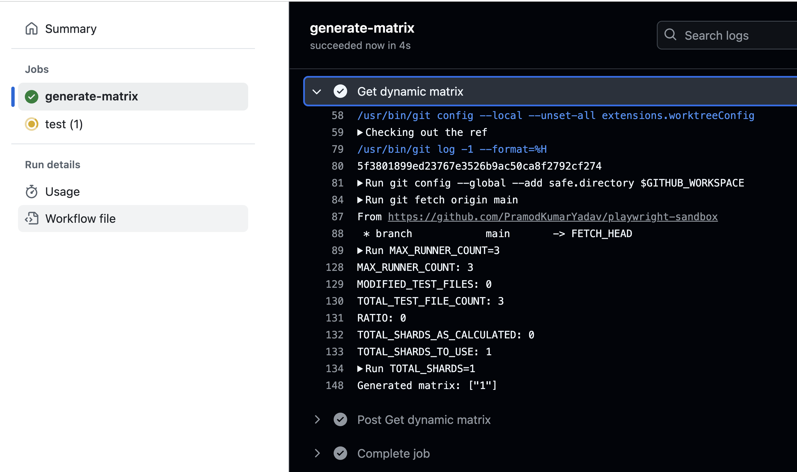
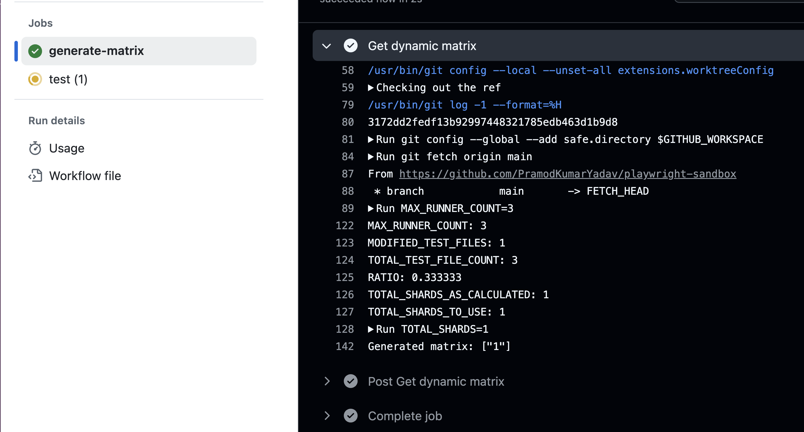
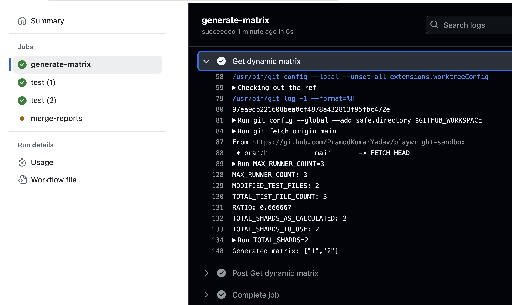
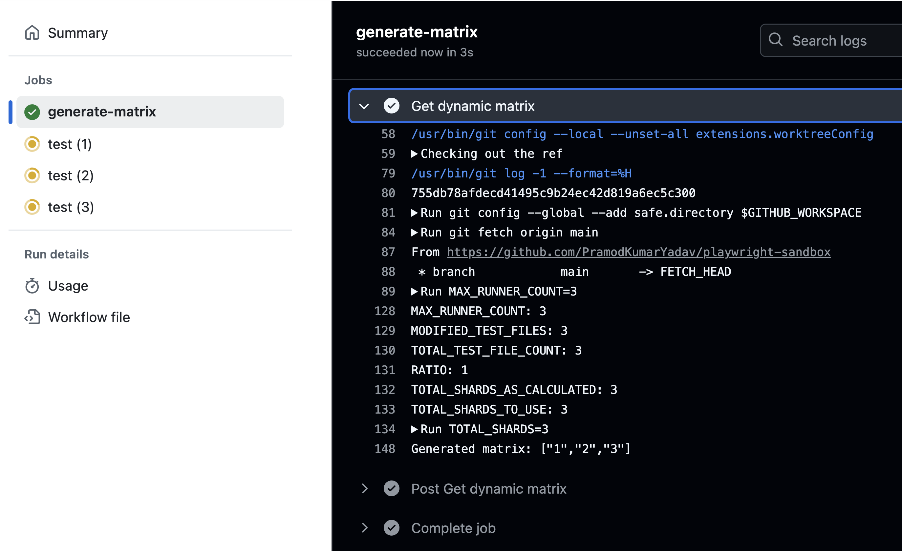

# playwright-loadbalancer
A GitHub action to provide a dynamic matrix based on the amount of test files changed in a pull request.

## Why this action?

Playwright provides an option to run tests on multiple runners using its sharding option as shown [here](https://playwright.dev/docs/test-sharding#github-actions-example). It also provides an option to run only tests that are changed in a pull request as shown [here](https://playwright.dev/docs/release-notes#--only-changed-cli-option). 

Lets take an example to understand a interesting use case the combination of these two creates. 

Imagine you have 60 test files and you use 6 github runners to run the files on a sharded manner. You have hardcoded this matrix as `shardIndex: [1, 2, 3, 4, 5, 6]`, as shown in the example from Playwright above. 

Now imagine a tester fixes a flaky test case in a file or adds a few test cases in a test file and push the changes to create a micro PR. If your pull request workflow use this command `npx playwright test --only-changed=origin/main` to run only changed test cases, it would still create 6 runners, even though it may only need one to run those one or two test cases. If this happens frequently, it would result in wasted billable GitHub runner minutes over a period of time for no value in return. 

Wouldn't it be nice if based on the ratio of files touched to the total files, we could generate a dynamic GitHub matrix on run time? This is exactly the problem this action was created to solve. 

> [!NOTE]
>
> I aim to create another GitHub action for other use cases such as running tests on PUSH or on a schedule. Where you may not have any changed files to decide the number of runners but use a "test case" count to run to arrive at a similar matrix. To be published soon :).

## Inputs

```yaml {"id":"01J2XFHJFST5N0A1651KZ5JCAT"}
inputs:
  max-runners:  
    description: 'maximum number of runners to be used'
    required: true
```

## Outputs

```yaml {"id":"01J2XFHJFST5N0A1651MMCD9FR"}
outputs:
  dynamic-matrix:
    description: "dynamic matrix to use"
    value: ${{ steps.set-matrix.outputs.dynamic_matrix }}

```

## Example usage

Below is working and tested example of a workflow that uses this action. 

```yaml {"id":"01J2NSXS32KV8TSMM4W64D9WMT"}
name: Run Tests and Publish Results

on:
  pull_request:
    branches: ["main"]

  # Allows you to run this workflow manually from the Actions tab
  workflow_dispatch:

# Grant GITHUB_TOKEN the permissions required to make a Pages deployment
permissions:
  contents: read
  pages: write
  id-token: write

# Allow only one concurrent deployment, skipping runs queued between the run in-progress and latest queued.
# However, do NOT cancel in-progress runs as we want to allow these production deployments to complete.
# NOTE: In an actual project, you may want to skip concurrent deployments since they are slow. This is just for example. 
concurrency:
  group: "pages"
  cancel-in-progress: false

jobs:
  generate-matrix:
    runs-on: ubuntu-latest
    outputs:
      dynamic_matrix: ${{ steps.get-dynamic-matrix.outputs.dynamic-matrix }}
    steps:
      - name: Get dynamic matrix
        uses: PramodKumarYadav/playwright-loadbalancer@main
        id: get-dynamic-matrix
        with:
          max-runners: 6

  test:
    timeout-minutes: 60
    needs: generate-matrix
    runs-on: ubuntu-latest
    environment: dev
    container:
      image: mcr.microsoft.com/playwright:v1.47.2-jammy
    strategy:
      fail-fast: false
      matrix:
        runner: ${{ fromJSON(needs.generate-matrix.outputs.dynamic_matrix) }}
    steps:
      - name: Checkout Repository
        uses: actions/checkout@v4
        with:
          fetch-depth: 0

      - name: Mark Repository as Safe
        run: git config --global --add safe.directory $GITHUB_WORKSPACE

      - name: Setup Node
        uses: actions/setup-node@v4
        with:
          node-version: 18

      - name: Install project dependencies
        run: npm ci

      - name: Run Playwright tests
        # Index is zero based so add one to get shards index as 1,2,3 and thus ratio as 1/3, 2/3, 3/3.
        run: NODE_ENV=dev npx playwright test --only-changed=origin/main --shard=$((${{ strategy.job-index }} + 1))/${{ strategy.job-total }} --reporter=blob
        env:
          # HOME: /root
          HOST: ${{ secrets.HOST}}

      - name: Upload blob report to GitHub Actions Artifacts
        if: always()
        uses: actions/upload-artifact@v4
        with:
          name: blob-report-${{ matrix.runner }}-${{ strategy.job-index }}
          path: blob-report
          retention-days: 1

  merge-reports:
    # Merge reports after playwright-tests, even if some shards have failed
    needs: [test]
    if: always()
    runs-on: ubuntu-latest
    steps:
      - name: Checkout Repository
        uses: actions/checkout@v4

      - name: Setup Node
        uses: actions/setup-node@v4
        with:
          node-version: 18

      - name: Install project dependencies
        run: npm ci

      - name: Download blob reports from GitHub Actions Artifacts
        uses: actions/download-artifact@v4
        with:
          path: all-blob-reports
          pattern: blob-report-*
          merge-multiple: true

      - name: Merge into HTML Report
        run: npx playwright merge-reports --reporter html ./all-blob-reports

      - name: Upload HTML report
        uses: actions/upload-artifact@v4
        with:
          name: html-report--attempt-${{ github.run_attempt }}
          path: playwright-report
          retention-days: 14

      - name: Setup and Enable Pages
        uses: actions/configure-pages@v4

      - name: Upload artifact playwright-report
        uses: actions/upload-pages-artifact@v3
        with:
          path: "playwright-report"
          retention-days: 30

  # Publish test results job
  publish-results:
    # Add a dependency to the test job
    needs: merge-reports
    if: always()

    # Deploy to the github-pages environment
    environment:
      name: github-pages
      url: ${{ steps.deployment.outputs.page_url }}

    # Specify runner + deployment step
    runs-on: ubuntu-latest
    steps:
      - name: Deploy to GitHub Pages
        id: deployment
        uses: actions/deploy-pages@v4 # or specific "vX.X.X" version tag for this action

```

## Boundray value Tests 

### Test result when no test files are touched


### Test result when one-third files are touched


### Test result when two -third files are touched


### Test result when all files are touched


## Reference

To create and push new tags:

```sh {"id":"01J2XFHJFT1K765K3D5J6BDSSC"}
pramodyadav@Pramods-Laptop playwright-loadbalancer % git tag -a -m "add your message here" v1                   
pramodyadav@Pramods-Laptop playwright-loadbalancer % git push --follow-tags   
```